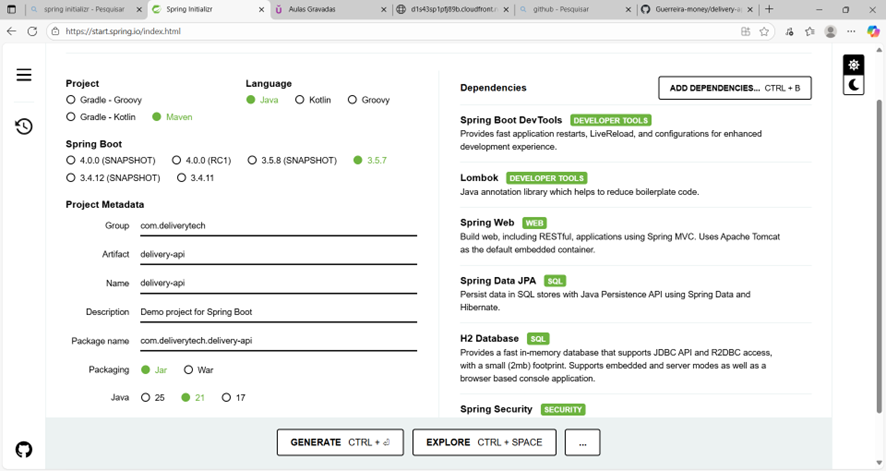

# 🚚 Delivery Tech API

Sistema de delivery desenvolvido com **Spring Boot 3.5.7** e **Java 21**, como parte do **projeto de extensão IBMR**.  
A aplicação foi criada a partir do **Spring Initializr**, utilizando **Maven** e empacotamento **JAR**, com dependências modernas para desenvolvimento ágil de APIs REST.

---

## 🚀 Tecnologias Utilizadas

| Tecnologia | Versão / Detalhe |
|-------------|------------------|
| **Java** | 21 LTS |
| **Spring Boot** | 3.5.7 |
| **Maven** | Projeto de build e gerenciamento de dependências |
| **Packaging** | JAR |
| **Banco de Dados** | H2 (em memória) |
| **IDE** | Visual Studio Code |

---

## 📦 Dependências Principais

| Dependência | Finalidade | Situação |
|--------------|-------------|----------|
| **Spring Boot DevTools** | Atualização automática e LiveReload durante o desenvolvimento | ✅ |
| **Lombok** | Reduz código repetitivo com anotações como `@Getter` e `@Setter` | ✅ |
| **Spring Web** | Criação de APIs REST e controle via Spring MVC | ✅ |
| **Spring Data JPA** | Persistência com Hibernate e integração com bancos de dados | ✅ |
| **H2 Database** | Banco de dados em memória para testes e protótipos | ✅ |
  
---

## ⚙️ Estrutura do Projeto

delivery-api/
├── src/
│ ├── main/
│ │ ├── java/com/deliverytech/delivery_api/
│ │ │ ├── controllers/ → controladores REST
│ │ │ ├── dto/ → objetos de transferência de dados
│ │ │ ├── entity/ → entidades JPA
│ │ │ ├── repository/ → interfaces de persistência
│ │ │ ├── service/ → regras de negócio
│ │ │ └── DeliveryApiApplication.java → classe principal
│ │ └── resources/
│ │ ├── application.properties
│ │ ├── static/
│ │ └── templates/
├── pom.xml
├── mvnw / mvnw.cmd
└── LICENSE
└── README.md


## License
- Apache 2.0

## ⚡ Recursos Modernos Utilizados
- Records (Java 14+)
- Text Blocks (Java 15+)

## 🛠️ Como Executar
1. Pré-requisitos: JDK 21 instalado
2. Execute o projeto (`mvn spring-boot:run`)
3. Acesse:
   - `http://localhost:8081/health`
   - `http://localhost:8081/info`
   - `http://localhost:8081/h2-console`


---

## 📚 API Endpoints

**Base URL:** `http://localhost:8081`

### 🔧 Saúde / Info
| Método | Caminho        | Descrição                          |
|--------|-----------------|------------------------------------|
| GET    | `/health`       | Status da aplicação                |
| GET    | `/info`         | Metadados básicos da aplicação     |
| GET    | `/h2-console`   | Console do H2 (interface web)      |

---

### 👤 Clientes
| Método | Caminho                     | Descrição                                   |
|--------|-----------------------------|---------------------------------------------|
| POST   | `/clientes`                 | Cadastrar cliente                           |
| GET    | `/clientes`                 | Listar **apenas clientes ativos**           |
| GET    | `/clientes/{id}`            | Buscar por ID                               |
| PUT    | `/clientes/{id}`            | Atualizar dados                             |
| DELETE | `/clientes/{id}`            | **Inativar** (soft delete)                  |
| GET    | `/clientes/buscar?nome=...` | Buscar por nome (contém/ignore case)        |
| GET    | `/clientes/email/{email}`   | Buscar por e-mail                           |

**Exemplo – criar cliente**
```bash
curl -X POST http://localhost:8081/clientes \
  -H "Content-Type: application/json" \
  -d '{
    "nome": "Ana Silva",
    "email": "ana@example.com",
    "telefone": "21999998888",
    "endereco": "Rua Alfa, 100"
  }'

| Método | Caminho              | Descrição                     |
| ------ | -------------------- | ----------------------------- |
| POST   | `/restaurantes`      | Cadastrar restaurante         |
| GET    | `/restaurantes`      | Listar restaurantes           |
| GET    | `/restaurantes/{id}` | Buscar por ID                 |
| PUT    | `/restaurantes/{id}` | Atualizar                     |
| DELETE | `/restaurantes/{id}` | Inativar/fechar (soft delete) |

| Método | Caminho                                 | Descrição                            |
| ------ | --------------------------------------- | ------------------------------------ |
| POST   | `/produtos`                             | Cadastrar produto                    |
| GET    | `/produtos`                             | Listar todos                         |
| GET    | `/produtos/{id}`                        | Buscar por ID                        |
| PUT    | `/produtos/{id}`                        | Atualizar                            |
| DELETE | `/produtos/{id}`                        | Excluir                              |
| GET    | `/produtos/restaurante/{restauranteId}` | Listar por restaurante               |
| GET    | `/produtos/buscar?nome=...`             | Buscar por nome (contém/ignore case) |

curl -X POST http://localhost:8081/produtos \
  -H "Content-Type: application/json" \
  -d '{
    "nome": "Pizza Margherita",
    "preco": 49.90,
    "ativo": true,
    "restaurante": { "id": 1 }
  }'

| Método | Caminho                                   |Descrição                                              |             |                  |
| ------ | ----------------------------------------- | ------------------------------------------------------ | ----------- | ---------------- |
| POST   | `/pedidos`                                | Criar pedido (gera `uuid`, status inicial `CRIADO`)    |             |                  |
| GET    | `/pedidos/{uuid}`                         | Buscar pedido por **UUID**                             |             |                  |
| GET    | `/pedidos/cliente/{clienteId}`            | Listar pedidos do cliente (ordem desc por criação)     |             |                  |
| GET    | `/pedidos/restaurante/{restauranteId}`    | Listar pedidos do restaurante (ordem desc por criação) |             |                  |
| PATCH  | `/pedidos/{uuid}/status?valor={CONFIRMADO | ENTREGUE                                               | CANCELADO}` | Atualizar status |

curl -X POST http://localhost:8081/pedidos \
  -H "Content-Type: application/json" \
  -d '{
    "clienteId": 1,
    "restauranteId": 1,
    "itens": [
      { "produtoId": 10, "quantidade": 2, "precoUnitario": 39.90 },
      { "produtoId": 12, "quantidade": 1, "precoUnitario": 9.90 }
    ],
    "observacao": "Sem cebola"
  }'

{
  "uuid": "9f3f1c1a-8d8d-4c9d-9c7d-2b0f4c2a1f10",
  "status": "CRIADO",
  "cliente": { "id": 1, "nome": "Ana Silva" },
  "restaurante": { "id": 1, "nome": "Pizzaria Alfa" },
  "itens": [
    { "produtoId": 10, "nome": "Pizza Margherita", "quantidade": 2, "precoUnitario": 39.9, "subtotal": 79.8 },
    { "produtoId": 12, "nome": "Coca 350ml", "quantidade": 1, "precoUnitario": 9.9, "subtotal": 9.9 }
  ],
  "total": 89.7,
  "dataCriacao": "2025-10-30T21:31:00"
}

curl -X PATCH "http://localhost:8081/pedidos/9f3f1c1a-8d8d-4c9d-9c7d-2b0f4c2a1f10/status?valor=CONFIRMADO"


### ▶️ Executando a Aplicação
No terminal, dentro da pasta do projeto (`delivery-api`), execute:

```bash
mvn spring-boot:run

## 👩‍💻 Desenvolvedor
**Viviane Costa Ferreira** — IBMR  
**RA:** 1262429956  

**CURSO:** Análise e Desenvolvimento de Sistemas 

Desenvolvido com **JDK 21** e **Spring Boot 3.2.x**

**DELIVERY-API (PROJETO DE EXTENSÃO)** 

